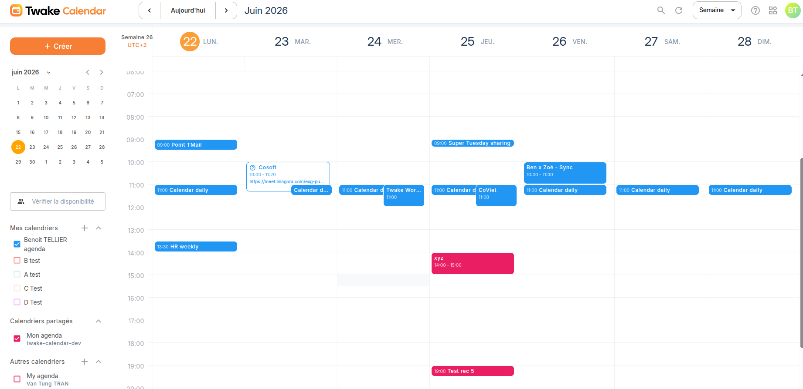

# Twake Calendar Frontend




## Goals

This project aims at serving a Single Page Application allowing a user to interact with its calendar.

This frontend application is built in a monorepo structure with Rsbuild, React, and TypeScript. It interacts with:

- [esn-sabre](https://github.com/linagora/esn-sabre/) CalDAV + CardDAV server, tailor made for LINAGORA needs.
- [Twake Calendar side service](https://github.com/linagora/twake-calendar-side-service) that delivers additional backend features for Sabre.

It is meant as a drop-in replacement of [esn-frontend-calendar](https://github.com/linagora/esn-frontend-calendar).

---

## Project Structure

The repository is organized as a monorepo workspace:

- **[`apps/private`](apps/private)**: The main private calendar application. Accessible by authenticated users.
- **[`apps/public`](apps/public)**: The public calendar application. Used for public event previews and shared links.
- **[`common`](common)**: Shared components, hooks, translation locales, and utility functions used by both applications.

---

## Frontend Routes

### Private App (`apps/private`)

| Route | Description |
|-------|-------------|
| `/` | Login handler |
| `/calendar` | Main calendar view (authenticated) |
| `/callback` | OAuth callback |
| `/error` | Error page |

### Public App (`apps/public`)

| Route | Description |
|-------|-------------|
| `/excal?jwt=${token}` | Event preview via JWT token |
| `/booking/${bookingLinkPublicId}` | Public booking page for a shared link |

---

## Contributing

### Formatting

We use [Prettier](https://prettier.io/) to keep code style consistent.
A `.prettierrc` file is already included in the repo, so formatting rules are predefined.

Before committing, make sure you format your files either using your IDE Prettier extension or Prettier CLI.

---

## Running it

Requirement: **Node 24+**

First, install the dependencies from the root directory:

```bash
npm install
```

### Development Mode

To start the applications in development mode, use the following commands:

- **Private Application**:

  ```bash
  npm run start:private
  ```

  Runs the private app on [http://localhost:5000](http://localhost:5000).

- **Public Application**:
  ```bash
  npm run start:public
  ```
  Runs the public app on [http://localhost:5001](http://localhost:5001).

### Production Build

To build the applications for production, run:

- **Build Both Apps**:

  ```bash
  npm run build
  ```

- **Build Private App Only**:

  ```bash
  npm run build:private
  ```

- **Build Public App Only**:
  ```bash
  npm run build:public
  ```

The production bundles will be compiled to `apps/private/dist` and `apps/public/dist` respectively.

### Serving Locally

You can serve the built production assets locally using:

- **Serve Private App**:

  ```bash
  npm run serve:private
  ```

  Serves on [http://localhost:5000](http://localhost:5000).

- **Serve Public App**:
  ```bash
  npm run serve:public
  ```
  Serves on [http://localhost:5001](http://localhost:5001).

### Running Tests

Launches the Jest test runner:

```bash
npm test
```

### Linting

To run the ESLint checks:

```bash
npm run lint
```

To automatically fix formatting and lint errors:

```bash
npm run lint:fix
```

---

## Running with Docker

First, build the applications:

```bash
npm run build
```

Then build the Docker image for the specific application:

```bash
# For private app:
docker build -f apps/private/Dockerfile -t linagora/twake-calendar-private .

# For public app:
docker build -f apps/public/Dockerfile -t linagora/twake-calendar-public .
```

To run the container, mount the `.env.js` configuration file from the root `public/` directory:

```bash
docker run -d \
  -v $PWD/public/.env.js:/usr/share/nginx/html/.env.js \
  -p 5000:80 \
  linagora/twake-calendar-private
```

---

## Configuring the Application

The applications load configuration dynamically at runtime from static JavaScript files in the `public` directory.

### Environment variables (`.env.js`)

1. Copy `public/.env.example.js` to `public/.env.js`
2. Customize the variables in `public/.env.js` to match your environment.

#### Public App Configuration Guideline

The **Public App** (`apps/public`) requires three specific environment variables to be defined in `.env.js` to configure external links in the user interface (such as help buttons and terms/privacy links in the page footers):

- **`SUPPORT_URL`**: The URL for the "Need help" button located in the top-right header of the public layout.
- **`PRIVACY_URL`**: The URL for the "Privacy Policy" link in the footer of the public layout.
- **`TERMS_URL`**: The URL for the "Terms of Service" link in the footer of the public layout.

Example `.env.js` snippet:

```javascript
var SUPPORT_URL = 'https://twake.com/help'
var PRIVACY_URL = 'https://twake.com/privacy'
var TERMS_URL = 'https://twake.com/terms'
```

### App list grid (`appList.js`)

An applist is configurable in the public folder to setup the grid of apps accessible within Twake Calendar (private app).

1. Copy `public/appList.example.js` to `public/appList.js`
2. Place your app icons in `public/assets/images/svg/` directory
3. Configure each app with three fields:
   - `name`: the app's name
   - `icon`: the path to the app's icon (relative to public folder, e.g., `/assets/images/svg/app-chat.svg`)
   - `link`: the app's link or URL

Example:

```js
var appList = [
  {
    name: 'Chat',
    link: '/twake',
    icon: '/assets/images/svg/app-chat.svg'
  },
  {
    name: 'Drive',
    link: '/drive',
    icon: '/assets/images/svg/app-drive.svg'
  },
  {
    name: 'Mail',
    link: '/mail',
    icon: '/assets/images/svg/app-mail.svg'
  }
]
```

**Note**: `appList.js` and `.env.js` are gitignored, so each environment can have its own configuration.

---

## Roadmap

Now that we delivered all features in **esn-frontend-calendar** we plan to work on even more exciting features:
 - Provide **Booking links** that allow people you send it to to book easily meeting with you, based on your availability.
 - Deliver **Drive** integration in order to attach files to your events
 - **Team Calendar** that would hold events of a team

Stay tuned!

## Credits

Developed with <3 at [LINAGORA](https://linagora.com) !
